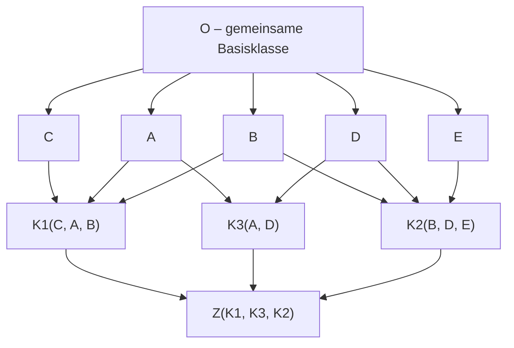

# Python

## Import Conventions

```python
import math
import io
import asyncio
import threading
import multiprocessing
import random
from typing import TypeVar, Generic, Union, Callable, Protocol
from functools import partial
from itertools import permutations, combinations, combinations_with_replacement
from collections import Counter
from abc import ABC, abstractmethod
```

---

## Data Types

Python's built-in types. Everything is an object, including primitives.

| Type    | Example                       | Mutable |
|---------|-------------------------------|---------|
| `int`   | `10`, `-3`, `0xFF`            | No      |
| `float` | `3.14`, `1e-9`                | No      |
| `str`   | `"hello"`, `'world'`          | No      |
| `bool`  | `True`, `False`               | No      |
| `list`  | `[1, 2, 3]`                   | Yes     |
| `tuple` | `(1, 2, 3)`                   | No      |
| `dict`  | `{"a": 1, "b": 2}`            | Yes     |
| `set`   | `{1, 2, 3}`                   | Yes     |

```python
num: int     = 10
flt: float   = 10.5
string: str  = "Hello, World!"
boolean: bool = True
lst: list    = [1, 2, 3, 4, 5]
tup: tuple   = (1, 2, 3)
dct: dict    = {"key1": "value1", "key2": "value2"}
st: set      = {1, 2, 3, 4, 5}

# Type checking
print(type(num))          # <class 'int'>
print(isinstance(num, int))  # True

# Type conversion
print(int("42"))          # 42
print(float("3.14"))      # 3.14
print(str(100))           # '100'
print(list((1, 2, 3)))    # [1, 2, 3]
print(tuple([1, 2, 3]))   # (1, 2, 3)
print(set([1, 2, 2, 3]))  # {1, 2, 3}
```

---

## Control Flow

```python
# if / elif / else
x = 7
if x > 10:
    print("large")
elif x > 4:
    print("medium")    # prints this
else:
    print("small")

# for loop
for i in range(5):          # 0..4
    print(i)

for i in range(2, 10, 2):   # 2, 4, 6, 8
    print(i)

# while loop
n = 5
while n > 0:
    print(n)
    n -= 1

# break / continue / else on loops
for i in range(10):
    if i == 3:
        continue           # skip 3
    if i == 7:
        break              # stop at 7
else:
    print("loop finished without break")  # not printed here

# Ternary expression
result = "even" if x % 2 == 0 else "odd"
```

### Comparison Chaining

Python allows chaining comparison operators naturally.

```python
a = 5
if 1 < a < 10:
    print(f"{a} is between 1 and 10")   # True

b = 3
if 0 <= b <= 5 and b != 4:
    print("b is valid")
```

### Match Statement (Python 3.10+)

Structural pattern matching — similar to `switch` but more powerful.

```python
match_value = 3

match match_value:
    case 1:
        print("Value is 1")
    case 2 | 3:
        print("Value is 2 or 3")  # prints this
    case int(n) if n > 3:
        print(f"Large integer: {n}")
    case _:
        print("Something else")

# Matching on structure
point = (0, 5)
match point:
    case (0, 0):
        print("Origin")
    case (0, y):
        print(f"On Y-axis at y={y}")  # prints this
    case (x, 0):
        print(f"On X-axis at x={x}")
    case (x, y):
        print(f"Point at ({x}, {y})")
```

### Walrus Operator (`:=`)

Assigns a value within an expression — useful in `while` loops and comprehensions.

```python
my_list = [1, 2, 3, 4, 5, 6, 7]

# Assign and test in one step
if (n := len(my_list)) > 5:
    print(f"List is too long ({n} elements)")

# In while loop — avoids reading twice
import io
stream = io.StringIO("line1\nline2\nline3")
while line := stream.readline():
    print(line.strip())
```

---

## Functions

```python
# Basic function with type hints
def add(a: int, b: int) -> int:
    return a + b

print(add(5, 10))  # 15

# Default parameters
def connect(host: str = "localhost", port: int = 8080) -> None:
    print(f"Connecting to {host} on port {port}")

connect()                         # localhost:8080
connect("example.com", 443)       # example.com:443
connect(port=9090)                # localhost:9090

# *args — arbitrary positional arguments (collected as a tuple)
def print_names(*names: str) -> None:
    for name in names:
        print(name)

print_names("Alice", "Bob", "Carol")

# **kwargs — arbitrary keyword arguments (collected as a dict)
def display(**info) -> None:
    for key, value in info.items():
        print(f"{key}: {value}")

display(name="Alice", age=30, city="Berlin")

# Combining all
def full_example(a, b=10, *args, **kwargs):
    print(a, b, args, kwargs)

full_example(1, 2, 3, 4, x=5, y=6)  # 1 2 (3, 4) {'x': 5, 'y': 6}
```

### Returning Functions

Functions are first-class objects in Python — they can be returned, passed as arguments, and stored in variables.

```python
from typing import Callable

def outer_function(msg: str) -> Callable:
    def inner_function():
        print(msg)
    return inner_function

say_hello = outer_function("Hello!")
say_hello()  # Hello!

# Function as argument
def apply_function(func: Callable, value: int) -> int:
    return func(value)

print(apply_function(lambda x: x * x, 5))  # 25
```

---

## Lambdas

Anonymous single-expression functions. Best used for short, throwaway transformations.

```python
square: Callable[int, int] = lambda x: x * x

print(square(5))   # 25

add = lambda a, b: a + b
print(add(3, 4))   # 7

# Common use: as key in sort / filter / map
data = [(1, "b"), (3, "a"), (2, "c")]
data.sort(key=lambda item: item[1])
print(data)   # [(3, 'a'), (1, 'b'), (2, 'c')]

nums = [1, 2, 3, 4, 5, 6]
evens  = list(filter(lambda x: x % 2 == 0, nums))   # [2, 4, 6]
doubled = list(map(lambda x: x * 2, nums))           # [2, 4, 6, 8, 10, 12]
```

---

## Type Hints & Annotations

Type hints do not enforce types at runtime — they are hints for IDEs, linters, and static checkers like `mypy`.

```python
# Basic annotations
def greet(name: str) -> str:
    return f"Hello, {name}!"

# Union types
from typing import Union

def process_data(data: int | str) -> None:
    if isinstance(data, int):
        print(f"Integer: {data}")
    elif isinstance(data, str):
        print(f"String: {data}")

var: Union[float, str] = 10   # same as float | str

# Optional (value can be None)
from typing import Optional
def find(name: str) -> Optional[str]:
    return name if name else None

# Callable type hint
from typing import Callable
def run(func: Callable[[int, int], int], a: int, b: int) -> int:
    return func(a, b)

# Collections with element types
from typing import List, Dict, Tuple, Set
nums: List[int] = [1, 2, 3]
table: Dict[str, int] = {"a": 1}
pair: Tuple[int, str] = (1, "hello")
unique: Set[float] = {1.0, 2.0}

# Python 3.9+ — use built-in generics directly
nums2: list[int] = [1, 2, 3]
table2: dict[str, int] = {"a": 1}
```

---

## Closures

A **closure** is a function that captures variables from the scope in which it was defined, even after that scope has exited.

- `nonlocal`

```python
def closure_example(s: str):
    message = "Hello "

    def add_world():
        print(message + s)   # captures 'message' and 's'

    return add_world

func = closure_example("world")
func()   # Hello world

# Practical use: factory functions
def make_multiplier(factor: int) -> Callable:
    def multiply(x: int) -> int:
        return x * factor    # captures 'factor'
    return multiply

double = make_multiplier(2)
triple = make_multiplier(3)
print(double(5))   # 10
print(triple(5))   # 15

# Mutable closure variable — use a list or nonlocal
def make_counter():
    count = 0
    def increment():
        nonlocal count
        count += 1
        return count
    return increment

counter = make_counter()
print(counter())  # 1
print(counter())  # 2
print(counter())  # 3
```

---

## Decorators

Decorators are functions that wrap another function to modify or extend its behavior without changing its source code.

```python
from typing import Callable

def decorator_function(original_function: Callable) -> Callable:
    def wrapper_function(*args, **kwargs):
        print(f"Before {original_function.__name__}")
        result = original_function(*args, **kwargs)
        print(f"After {original_function.__name__}")
        return result
    return wrapper_function

@decorator_function
def display():
    print("Display function executed")

display()
# Before display
# Display function executed
# After display

# Decorator with parameters — requires an extra layer
def repeat(n: int) -> Callable:
    def decorator(func: Callable) -> Callable:
        def wrapper(*args, **kwargs):
            for _ in range(n):
                func(*args, **kwargs)
        return wrapper
    return decorator

@repeat(3)
def say_hi():
    print("Hi!")

say_hi()  # prints "Hi!" three times

# Preserving the wrapped function's metadata
import functools

def my_decorator(func: Callable) -> Callable:
    @functools.wraps(func)   # preserves __name__, __doc__, etc.
    def wrapper(*args, **kwargs):
        return func(*args, **kwargs)
    return wrapper
```


### Class Decorator

---

## Classes & Objects

### Basic Class

```python
class Person:

    species = "Homo sapiens"     # class attribute — shared across all instances

    def __init__(self, name: str, age: int):
        self.name = name         # instance attribute
        self.age = age

    def greet(self) -> str:
        return f"Hello, I am {self.name}, age {self.age}."

    def __repr__(self) -> str:   # unambiguous representation (used in logs, REPL)
        return f"Person(name={self.name!r}, age={self.age})"

    def __str__(self) -> str:    # human-readable representation (used by print)
        return self.greet()

    def __add__(self, other: "Person") -> "Person":
        return Person(f"{self.name} & {other.name}", self.age + other.age)

person = Person("Alice", 30)
print(person)             # Hello, I am Alice, age 30.
print(repr(person))       # Person(name='Alice', age=30)

p1 = Person("Alice", 30)
p2 = Person("Bob", 25)
p3 = p1 + p2
print(p3.name)            # Alice & Bob
```

### Dunder (Magic) Methods

Dunder methods allow customization of class behavior for built-in operations.

| Method                          | Triggered by                        |
|---------------------------------|-------------------------------------|
| `__init__(self, ...)`           | Object construction                 |
| `__repr__(self)`                | `repr(obj)`, REPL display           |
| `__str__(self)`                 | `str(obj)`, `print(obj)`            |
| `__len__(self)`                 | `len(obj)`                          |
| `__getitem__(self, key)`        | `obj[key]`                          |
| `__setitem__(self, key, value)` | `obj[key] = value`                  |
| `__delitem__(self, key)`        | `del obj[key]`                      |
| `__contains__(self, item)`      | `item in obj`                       |
| `__iter__(self)`                | `iter(obj)`, `for x in obj`         |
| `__next__(self)`                | `next(obj)`                         |
| `__eq__(self, other)`           | `==`                                |
| `__lt__(self, other)`           | `<`                                 |
| `__le__(self, other)`           | `<=`                                |
| `__add__(self, other)`          | `+`                                 |
| `__sub__(self, other)`          | `-`                                 |
| `__mul__(self, other)`          | `*`                                 |
| `__truediv__(self, other)`      | `/`                                 |
| `__floordiv__(self, other)`     | `//`                                |
| `__mod__(self, other)`          | `%`                                 |
| `__pow__(self, other)`          | `**`                                |
| `__neg__(self)`                 | unary `-`                           |
| `__bool__(self)`                | `bool(obj)`, truthiness check       |
| `__hash__(self)`                | `hash(obj)`, dict/set membership    |
| `__call__(self, ...)`           | `obj(...)` — makes object callable  |
| `__enter__(self)`               | `with obj as x:`                    |
| `__exit__(self, exc_type, ...)` | end of `with` block                 |
| `__format__(self, spec)`        | `format(obj, spec)`, f-strings      |
| `__del__(self)`                 | garbage collection                  |

```python
class Point:

    def __init__(self, x: int, y: int):
        self.x = x
        self.y = y

    def __add__(self, other: "Point") -> "Point":
        return Point(self.x + other.x, self.y + other.y)

    def __eq__(self, other: object) -> bool:
        if not isinstance(other, Point):
            return NotImplemented
        return self.x == other.x and self.y == other.y

    def __repr__(self) -> str:
        return f"Point({self.x}, {self.y})"

    def __str__(self) -> str:
        return f"({self.x}, {self.y})"

    def __format__(self, format_spec: str) -> str:
        match format_spec:
            case "polar":
                r = (self.x ** 2 + self.y ** 2) ** 0.5
                theta = math.atan2(self.y, self.x)
                return f"Polar(r={r:.2f}, θ={theta:.2f})"
            case _:
                return str(self)

    def __bool__(self) -> bool:
        return self.x != 0 or self.y != 0   # origin is falsy

    def __len__(self) -> int:
        return 2   # a point has 2 coordinates

p1 = Point(1, 2)
p2 = Point(3, 4)
p3 = p1 + p2
print(p3)               # (4, 6)
print(f"{p1:polar}")    # Polar(r=2.24, θ=1.11)
print(bool(Point(0,0))) # False
```

### Operator Overloading

```python
class ComplexNumber:

    def __init__(self, real: float, imag: float):
        self.real = real
        self.imag = imag

    def __add__(self, other: "ComplexNumber") -> "ComplexNumber":
        return ComplexNumber(self.real + other.real, self.imag + other.imag)

    def __mul__(self, other: "ComplexNumber") -> "ComplexNumber":
        real_part = self.real * other.real - self.imag * other.imag
        imag_part = self.real * other.imag + self.imag * other.real
        return ComplexNumber(real_part, imag_part)

    def __str__(self) -> str:
        sign = "+" if self.imag >= 0 else "-"
        return f"{self.real} {sign} {abs(self.imag)}i"

c1 = ComplexNumber(1, 2)
c2 = ComplexNumber(3, 4)
print(c1 + c2)   # 4 + 6i
print(c1 * c2)   # -5 + 10i
```

---

## Inheritance

Python supports both single and multiple inheritance.

```python
class Vehicle:

    def __init__(self, make: str, model: str):
        self.make = make
        self.model = model

    def info(self) -> str:
        return f"{self.make} {self.model}"

class Car(Vehicle):

    def __init__(self, make: str, model: str, doors: int):
        super().__init__(make, model)   # call parent constructor
        self.doors = doors

    def info(self) -> str:
        return f"{super().info()}, Doors: {self.doors}"   # extend parent method

car = Car("Toyota", "Corolla", 4)
print(car.info())   # Toyota Corolla, Doors: 4
print(isinstance(car, Vehicle))   # True — Car is also a Vehicle
```

### Method Resolution Order (MRO)

When Python looks up a method or attribute in a multiple-inheritance hierarchy, it uses the **C3 linearization** algorithm (DFS with left-to-right priority). Use `ClassName.mro()` to inspect the order.

```python
class A:
    num = 10

class B(A):
    pass

class C(A):
    num = 1        # shadows A.num

class D(B, C):
    pass

print(D.mro())    # [D, B, C, A, object]
print(D.num)      # 1 — found in C before A (C3 order)
```

---

## Duck Typing & Polymorphism

Duck typing is Python's approach to polymorphism: if an object has the required method or attribute, it can be used in that role — no explicit interface needed.

```python
class Person:
    def be(self):
        print("Being a person")

class Otaku(Person):
    likes = "Anime"

class Normie(Person):
    has_a_girlfriend = True

class Robot:
    def be(self):     # satisfies the 'be()' protocol without inheriting Person
        print("Being a robot")

duck_list = [Otaku(), Normie(), Robot()]

for e in duck_list:
    e.be()   # works for all — they all have .be()
```

### static and staticmethod
---

## Abstract Classes

Abstract classes define an interface contract — subclasses must implement all abstract methods or they cannot be instantiated.

```python
from abc import ABC, abstractmethod

class Animal(ABC):

    @abstractmethod
    def sound(self) -> str:
        pass

    @abstractmethod
    def move(self) -> str:
        pass

    def describe(self) -> str:     # concrete method — shared by all subclasses
        return f"I make sound: {self.sound()} and I {self.move()}"

class Dog(Animal):

    def sound(self) -> str:
        return "Woof!"

    def move(self) -> str:
        return "run"

class Bird(Animal):

    def sound(self) -> str:
        return "Tweet!"

    def move(self) -> str:
        return "fly"

dog = Dog()
print(dog.describe())   # I make sound: Woof! and I run

# animal = Animal()   # TypeError: Can't instantiate abstract class
```

---

## Interfaces (Protocol)

`Protocol` from `typing` defines structural interfaces — a class satisfies the protocol if it has the required methods, without needing to inherit from it 
(pure duck typing + static checking).

```python
from typing import Protocol

class Shape(Protocol):

    def area(self) -> float:
        ...

    def perimeter(self) -> float:
        ...

class Rectangle:

    def __init__(self, width: float, height: float):
        self.width = width
        self.height = height

    def area(self) -> float:
        return self.width * self.height

    def perimeter(self) -> float:
        return 2 * (self.width + self.height)

class Circle:

    def __init__(self, radius: float):
        self.radius = radius

    def area(self) -> float:
        return math.pi * self.radius ** 2

    def perimeter(self) -> float:
        return 2 * math.pi * self.radius

def print_shape_info(shape: Shape) -> None:
    print(f"Area: {shape.area():.2f}, Perimeter: {shape.perimeter():.2f}")

print_shape_info(Rectangle(5, 10))   # Area: 50.00, Perimeter: 30.00
print_shape_info(Circle(7))          # Area: 153.94, Perimeter: 43.98
```

---

## MRO / Diamond Problem



Die Pfeile zeigen von der Basisklasse zur Unterklasse: `O` steht oben, `Z` unten.

```python
class O: ...
class A(O): ...
class B(O): ...
class C(O): ...
class D(O): ...
class E(O): ...

class K1(C, A, B): ...
class K3(A, D): ...
class K2(B, D, E): ...
class Z(K1, K3, K2): ...


def mro_names(cls: type[object]) -> list[str]:
    return [base.__name__ for base in cls.__mro__]


print(mro_names(Z))
# Z, K1, C, K3, A, K2, B, D, E, O, object
```

C3-Merksatz: Nimm immer den ersten Kopf der MRO-Listen, der nicht im Schwanz einer anderen Liste steht. So bleiben Elternreihenfolge und jede Klasse genau einmal erhalten.

---

## Dataclasses

--- 

## Generic Types

Generics allow writing reusable, type-safe classes and functions that work across different types.

```python
from typing import TypeVar, Generic

T = TypeVar('T')

class Box(Generic[T]):

    def __init__(self, content: T):
        self.content = content

    def get_content(self) -> T:
        return self.content

    def __repr__(self) -> str:
        return f"Box({self.content!r})"

int_box = Box[int](123)
str_box = Box[str]("Hello")

print(int_box.get_content())   # 123
print(str_box.get_content())   # Hello

# Generic function
def first(items: list[T]) -> T:
    return items[0]

print(first([10, 20, 30]))     # 10
print(first(["a", "b", "c"])) # a
```

---

## Generators

Generators are functions that lazily produce values using `yield`, pausing execution between each one. They are memory-efficient because they produce items one at a time rather than storing the entire sequence.

```python
def simple_generator():
    yield 1
    yield 2
    yield 3

# Iterate over it
for value in simple_generator():
    print(value)     # 1, 2, 3

# Manual control with next()
gen = simple_generator()
print(next(gen))     # 1
print(next(gen))     # 2
print(next(gen))     # 3
# next(gen)          # StopIteration

# Generator expression (like list comprehension but lazy)
squares = (x * x for x in range(10))   # not computed yet
print(next(squares))   # 0
print(list(squares))   # [1, 4, 9, ..., 81] — rest of the values

# Practical example — prime number generator
def prime_generator(start: int, end: int):
    for num in range(max(2, start), end + 1):
        limit = int(math.sqrt(num)) + 1
        for n in range(2, limit):
            if num % n == 0:
                break
        else:
            yield num   # only yields if the inner loop completed without break

print(list(prime_generator(2, 30)))  # [2, 3, 5, 7, 11, 13, 17, 19, 23, 29]
```

---

## Iterators

Any object implementing `__iter__()` and `__next__()` is an iterator. `iter()` gets an iterator from an iterable, `next()` advances it.

```python
my_list = [1, 2, 3, 4, 5]
my_iterator = iter(my_list)

print(next(my_iterator))   # 1
print(next(my_iterator))   # 2

for item in my_iterator:   # continues from where we left off
    print(item)            # 3, 4, 5

# Custom iterator
class CountDown:

    def __init__(self, start: int):
        self.current = start

    def __iter__(self):
        return self   # the object itself is the iterator

    def __next__(self) -> int:
        if self.current <= 0:
            raise StopIteration
        self.current -= 1
        return self.current + 1

for n in CountDown(5):
    print(n)   # 5, 4, 3, 2, 1
```

### `itertools`

The `itertools` module provides efficient building blocks for working with iterators.

```python
from itertools import (
    permutations, combinations, combinations_with_replacement,
    product, chain, islice, groupby, accumulate, cycle, repeat
)

data = [1, 2, 3]

# All orderings of length 2
print(list(permutations(data, 2)))               # [(1,2),(1,3),(2,1),(2,3),(3,1),(3,2)]

# All pairs without repetition
print(list(combinations(data, 2)))               # [(1,2),(1,3),(2,3)]

# All pairs allowing repetition
print(list(combinations_with_replacement(data, 2)))  # [(1,1),(1,2),(1,3),(2,2),(2,3),(3,3)]

# Cartesian product
print(list(product([0,1], repeat=3)))            # all 3-bit binary strings

# Chain multiple iterables
print(list(chain([1, 2], [3, 4], [5])))          # [1, 2, 3, 4, 5]

# First n elements
print(list(islice(range(1000), 5)))              # [0, 1, 2, 3, 4]

# Running totals
print(list(accumulate(data)))                    # [1, 3, 6]

# Group consecutive equal elements
grouped = [(k, list(v)) for k, v in groupby("aabbcc")]
print(grouped)   # [('a', ['a','a']), ('b', ['b','b']), ('c', ['c','c'])]
```

---

## List Comprehensions

Concise syntax for building lists, sets, dicts, and generators from iterables.

```python
# List comprehension
squares = [x * x for x in range(10)]
print(squares)   # [0, 1, 4, 9, 16, 25, 36, 49, 64, 81]

# With condition
evens = [x for x in range(20) if x % 2 == 0]

# Nested
pairs = [(x, y) for x in range(3) for y in range(3)]
print(pairs)   # [(0,0),(0,1),(0,2),(1,0),...,(2,2)]

# Set comprehension
unique_lengths = {len(word) for word in ["apple", "banana", "kiwi", "plum"]}
print(unique_lengths)   # {4, 5, 6}

# Dict comprehension
squared_dict = {x: x ** 2 for x in range(6)}
print(squared_dict)   # {0:0, 1:1, 2:4, 3:9, 4:16, 5:25}

# Generator expression (lazy)
total = sum(x * x for x in range(100))   # no intermediate list created
```

---

## List Methods

- `l.append(x)`: adds `x` to the end of the list.
- `l.extend(iterable)`: concatenates `iterable` to the end.
- `l.insert(i, x)`: inserts `x` before index `i`.
- `l.remove(x)`: removes the first occurrence of `x`. Raises `ValueError` if not found.
- `l.pop(i=-1)`: removes and returns the element at index `i` (default: last element).
- `l.index(x, start=0, end=None)`: returns the index of the first occurrence of `x`.
- `l.count(x)`: returns the number of occurrences of `x`.
- `l.sort(key=None, reverse=False)`: sorts the list in place.
- `l.reverse()`: reverses the list in place.
- `l.copy()`: returns a shallow copy.
- `l.clear()`: removes all elements.

```python
l = [1, 2, 3, 4, 5, 5, 6, 6, 7]

l.append(8)           # [1,2,3,4,5,5,6,6,7,8]
l.extend([9, 10])     # [1,2,...,9,10]
l.insert(0, 0)        # [0,1,2,3,4,5,5,6,6,7,8,9,10]
l.remove(5)           # removes first 5
l.pop()               # removes and returns 10
l.pop(0)              # removes and returns 0
print(l.index(6))     # index of first 6
print(l.count(6))     # how many 6s
l.sort()              # sort in place
l.sort(key=lambda x: -x, reverse=False)  # sort descending
l.reverse()           # reverse in place
lc = l.copy()         # shallow copy
l.clear()             # empty list
print(l)              # []
```

---

## Tuples

Immutable sequences. Faster than lists for fixed data, hashable (can be used as dict keys or set elements).

- `t.count(x)`: returns the number of occurrences of `x`.
- `t.index(x)`: returns the index of the first occurrence of `x`.

```python
t = (1, 2, 3, 2, 1)
print(t.count(2))    # 2
print(t.index(3))    # 2

# Tuple packing / unpacking
a, b, c = (1, 2, 3)
first, *rest = (10, 20, 30, 40)
print(first)   # 10
print(rest)    # [20, 30, 40]

# Single-element tuple requires trailing comma
single = (42,)
print(type(single))   # <class 'tuple'>

# Named tuples — lightweight alternative to a simple class
from collections import namedtuple
Point = namedtuple("Point", ["x", "y"])
p = Point(3, 4)
print(p.x, p.y)   # 3 4
print(p)          # Point(x=3, y=4)
```

---

## Dictionaries `dict`

Ordered, mutable key-value maps. Keys must be hashable.

- `d.get(key, default=None)`: returns the value for `key`, or `default` if not found.

- `d.setdefault(key, default=None)`: if `key` is absent, inserts it with `default` and returns it.

- `d.update(other)`: merges `other` (dict or iterable of key-value pairs) into `d`.

- `d.keys()`: returns a view of all keys.

- `d.values()`: returns a view of all values.

- `d.items()`: returns a view of all `(key, value)` pairs.

- `d.pop(key, default)`: removes and returns the value for `key`. Raises `KeyError` if absent and no default.

- `d.popitem()`: removes and returns the last inserted `(key, value)` pair.

- `d.copy()`: returns a shallow copy.

- `d.clear()`: removes all entries.

- `dict.fromkeys(iterable, value=None)`: class method — creates a dict from an iterable of keys with an optional default value `defaultdict(type)`: it initializes an empty value of `type` for the dictionary to use and avoiding setting a new key every time 

- `defaultdict(type)`: it initializes an empty value of `type` for the dictionary to use and avoiding setting a default value for a new pair manually.

```python
d = {"a": 1, "b": 2, "c": 3}

# Access
print(d["a"])                 # 1
print(d.get("z", "missing"))  # missing — no KeyError

# Modify
d["d"] = 4                    # add new key
d.update({"e": 5, "f": 6})   # merge
d.setdefault("g", 99)         # inserts g=99 and returns 99

# Iterate
for key, value in d.item():
    print(f"{key}: {value}")

# Remove
d.pop("a")                    # remove "a"
d.popitem()                   # remove last item

# Dict comprehension
squared = {k: v ** 2 for k, v in d.items()}

# Merge dicts (Python 3.9+)
d1 = {"a": 1, "b": 2}
d2 = {"c": 3, "d": 4}
merged = d1 | d2              # new dict
d1 |= d2                      # in-place merge

# fromkeys
keys = ["name", "age", "city"]
empty = dict.fromkeys(keys, None)
print(empty)   # {'name': None, 'age': None, 'city': None}

# From iterable of pairs
users = {0: "Alice", 1: "Bob", 2: "Carol"}
users_copy = users.copy()
users.clear()

# Create a default dictionary
from collections import defaultdict 
d = defaultdict(list)
c["key"] = [1,2,4]
```

---

## Sets

Unordered collections of unique, hashable elements. Useful for membership tests and set operations.

- `s.add(x)`: adds element `x`.
- `s.remove(x)`: removes `x`. Raises `KeyError` if not found.
- `s.discard(x)`: removes `x` if present. No error if absent.
- `s.update(iterable)`: adds all elements from `iterable`.
- `s.clear()`: removes all elements.
- `s.copy()`: shallow copy.
- `s & other` or `s.intersection(other)`: elements in both sets.
- `s | other` or `s.union(other)`: elements in either set.
- `s - other` or `s.difference(other)`: elements in `s` but not in `other`.
- `s ^ other` or `s.symmetric_difference(other)`: elements in exactly one of the sets.
- `s.issubset(other)`: `True` if `s ⊆ other`.
- `s.issuperset(other)`: `True` if `s ⊇ other`.
- `s.isdisjoint(other)`: `True` if `s` and `other` share no elements.

```python
s = {1, 2, 3, 4}
t = {3, 4, 5, 6}

s.add(5)
s.remove(1)
s.discard(99)          # no error

print(s & t)           # {3, 4, 5}  — intersection
print(s | t)           # {2, 3, 4, 5, 6}  — union
print(s - t)           # {2}  — difference
print(s ^ t)           # {2, 6}  — symmetric difference

print(s.issubset(t))        # False
print({3, 4}.issubset(t))   # True

# Frozenset — immutable set (hashable, can be dict key)
fs = frozenset([1, 2, 3])
```

---

## Strings

Strings are immutable sequences of Unicode characters.

- `s.capitalize()`: first character uppercase, rest lowercase.
- `s.lower()` / `s.upper()` / `s.title()` / `s.swapcase()`: case conversions.
- `s.casefold()`: aggressive lowercase for case-insensitive comparisons (handles non-ASCII).
- `s.strip(chars=None)` / `s.lstrip()` / `s.rstrip()`: removes leading/trailing characters (default: whitespace).
- `s.removeprefix(prefix)` / `s.removesuffix(suffix)`: removes a prefix/suffix if present (Python 3.9+).
- `s.replace(old, new, count=-1)`: replaces occurrences of `old` with `new`. `count` limits replacements.
- `s.split(sep=None, maxsplit=-1)`: splits at `sep`. If `sep` is `None`, splits on any whitespace and removes empty strings.
- `s.rsplit(sep=None, maxsplit=-1)`: like `split` but starts from the right.
- `s.splitlines(keepends=False)`: splits at line boundaries.
- `s.join(iterable)`: joins elements of `iterable` with `s` as separator.
- `s.find(sub, start=0, end=None)`: returns the lowest index where `sub` is found, or `-1`.
- `s.rfind(sub)`: like `find` but searches from the right.
- `s.index(sub)`: like `find` but raises `ValueError` if not found.
- `s.rindex(sub)`: like `index` from the right.
- `s.count(sub, start=0, end=None)`: counts non-overlapping occurrences of `sub`.
- `s.startswith(prefix)` / `s.endswith(suffix)`: returns `True`/`False`. Accepts tuples for multiple patterns.
- `s.center(width, fillchar=' ')` / `s.ljust(width, fillchar)` / `s.rjust(width, fillchar)`: padding.
- `s.zfill(width)`: pads with leading zeros.
- `s.encode(encoding='utf-8')`: returns the string as a `bytes` object.
- `s.format(*args, **kwargs)`: formats a string using `{}` placeholders.
- `s.format_map(mapping)`: like `format` but takes a mapping directly.
- `s.partition(sep)`: splits at the first occurrence of `sep`, returns `(before, sep, after)`.
- `s.rpartition(sep)`: like `partition` but from the right.
- `s.maketrans(x, y, z)`: creates a translation table for use with `translate()`.
- `s.translate(table)`: applies a translation table to each character.
- `s.isalnum()` / `s.isalpha()` / `s.isdigit()` / `s.isnumeric()` / `s.isdecimal()`: character class checks.
- `s.isspace()` / `s.isupper()` / `s.islower()` / `s.istitle()` / `s.isidentifier()` / `s.isprintable()` / `s.isascii()`: additional checks.

```python
s = "  Hello, Data Science!  "

print(s.strip())                    # "Hello, Data Science!"
print(s.strip().lower())            # "hello, data science!"
print(s.strip().title())            # "Hello, Data Science!"
print(s.strip().replace("Data Science", "Python"))  # "Hello, Python!"
print(s.strip().split(", "))        # ['Hello', 'Data Science!']
print(s.strip().count("e"))         # 2
print(s.strip().startswith("Hello"))  # True
print(s.strip().endswith(("!", "."))) # True — tuple = or

# Joining
words = ["a", "b", "c"]
print("-".join(words))              # "a-b-c"
print("".join(words))               # "abc"

# Padding
print("hi".center(10, "-"))         # "----hi----"
print("42".zfill(6))                # "000042"

# Partition
print("key=value".partition("="))   # ('key', '=', 'value')

# Format
print("Name: {}, Age: {}".format("Alice", 30))
print(f"Name: {'Alice'}, Age: {30}")  # f-string (preferred)

d = {"person": "Bob"}
print("Hello, {person}!".format_map(d))  # Hello, Bob!

# Translation
table = str.maketrans("aeiou", "AEIOU")
print("hello world".translate(table))    # "hEllO wOrld"

# Encoding
raw = "hello".encode("utf-8")       # b'hello'
back = raw.decode("utf-8")          # 'hello'

# Find vs index
print("abcabc".find("b"))           # 1
print("abcabc".rfind("b"))          # 4
# "abcabc".index("z")              # ValueError
```

---

## Slicing

General form: `sequence[start:stop:step]`. Works on lists, tuples, strings, and any sequence.

- `start`: beginning index (inclusive, default 0).
- `stop`: ending index (exclusive, default end of sequence).
- `step`: step size (default 1); negative step reverses direction.

```python
my_list = [0, 1, 2, 3, 4, 5, 6, 7, 8, 9]

print(my_list[2:8])       # [2, 3, 4, 5, 6, 7]
print(my_list[2:8:2])     # [2, 4, 6]
print(my_list[::-1])      # [9, 8, 7, 6, 5, 4, 3, 2, 1, 0] — reversed
print(my_list[:5])        # [0, 1, 2, 3, 4]
print(my_list[5:])        # [5, 6, 7, 8, 9]
print(my_list[-3:])       # [7, 8, 9] — last 3

# Slice object for reuse
rev = slice(None, None, -1)
print(my_list[rev])       # [9, 8, 7, ..., 0]

# Works on strings
s = "Hello, World!"
print(s[7:12])            # World
print(s[::-1])            # !dlroW ,olleH
```

---

## Unpacking

```python
# Basic unpacking
a, b, c = [1, 2, 3]

# Starred unpacking — rest goes to a list
first, *rest = [1, 2, 3, 4, 5]
print(first)   # 1
print(rest)    # [2, 3, 4, 5]

a, b, *middle, last = range(6)
print(middle)  # [2, 3, 4]

# Ignoring values
a, _, c = [1, 2, 3]   # _ by convention means "discard"

# Nested unpacking
data = ("Alice", (25, "Engineering"))
name, (age, dept) = data
print(name, age, dept)   # Alice 25 Engineering

# Unpacking in function calls
def add_3(x, y, z):
    return x + y + z

nums = [1, 2, 3]
print(add_3(*nums))        # unpack list as positional args

opts = {"x": 1, "y": 2, "z": 3}
print(add_3(**opts))       # unpack dict as keyword args

# Combining sequences
l1, l2 = [1, 2, 3], [4, 5, 6]
l3 = [*l1, *l2]           # [1, 2, 3, 4, 5, 6]

d1, d2 = {"a": 1}, {"b": 2}
d3 = {**d1, **d2}         # {"a": 1, "b": 2}

# Swap without a temporary variable
x, y = 2, 1
x, y = y, x
print(x, y)   # 1 2
```

---

## Error Handling

```python
# Basic try / except / else / finally
try:
    result = 10 / 0
except ZeroDivisionError as e:
    print(f"Caught: {e}")
except (TypeError, ValueError) as e:
    print(f"Type or value error: {e}")
else:
    print("No error occurred")    # runs only if no exception was raised
finally:
    print("Always runs")          # cleanup code

# Raising exceptions
def validate_age(age: int) -> None:
    if age < 0:
        raise ValueError(f"Age cannot be negative: {age}")
    if not isinstance(age, int):
        raise TypeError("Age must be an integer")

# Custom exception
class InsufficientFundsError(Exception):
    def __init__(self, amount: float, balance: float):
        super().__init__(f"Cannot withdraw {amount}: balance is {balance}")
        self.amount = amount
        self.balance = balance

try:
    raise InsufficientFundsError(100, 50)
except InsufficientFundsError as e:
    print(e)   # Cannot withdraw 100: balance is 50

# Re-raising
try:
    int("not a number")
except ValueError:
    print("Logging error...")
    raise   # re-raise the same exception
```

---

## Context Managers (`with`)

The `with` statement ensures resources are properly acquired and released, even if an exception occurs.

```python
# File I/O — most common use case
with open("sample.txt", "w") as f:
    f.write("Hello, World!")
# file is automatically closed after the block

with open("sample.txt", "r") as f:
    content = f.read()
    print(content)

# Multiple context managers in one with
with open("in.txt") as fin, open("out.txt", "w") as fout:
    fout.write(fin.read())
```

### Defining a Custom Context Manager

Use the `contextlib.contextmanager` decorator to create a context manager from a generator function.

```python
from contextlib import contextmanager

@contextmanager
def managed_resource(name: str):
    print(f"Acquiring {name}")
    try:
        yield name      # value bound to the 'as' variable
    finally:
        print(f"Releasing {name}")   # always runs

with managed_resource("database") as res:
    print(f"Using {res}")
# Acquiring database
# Using database
# Releasing database

# Class-based context manager — using __enter__ and __exit__
class Timer:
    import time

    def __enter__(self):
        self.start = __import__("time").time()
        return self

    def __exit__(self, exc_type, exc_val, exc_tb):
        elapsed = __import__("time").time() - self.start
        print(f"Elapsed: {elapsed:.4f}s")
        return False   # False = do not suppress exceptions

with Timer() as t:
    sum(range(1_000_000))
```

### Async Context Manager

For use inside `async` functions — the resource is managed with `async with`.

```python
import asyncio
from contextlib import asynccontextmanager

@asynccontextmanager
async def async_resource(name: str):
    print(f"Async acquiring {name}")
    try:
        yield name
    finally:
        print(f"Async releasing {name}")

async def main():
    async with async_resource("connection") as res:
        print(f"Using {res}")
        await asyncio.sleep(0)

asyncio.run(main())
```

---

## Input / Output

### Console I/O

```python
name = input("Enter your name: ")
print(f"Hello, {name}!")

# print options
print("a", "b", "c", sep="-")    # a-b-c
print("no newline", end="")
print(" — same line")
```

### File I/O

```python
# Write
with open("sample.txt", "w", encoding="utf-8") as f:
    f.write("Hello, World!\n")
    f.writelines(["line 1\n", "line 2\n"])

# Read
with open("sample.txt", "r", encoding="utf-8") as f:
    all_text = f.read()          # entire file as string
    
with open("sample.txt", "r") as f:
    lines = f.readlines()        # list of lines
    
with open("sample.txt", "r") as f:
    for line in f:               # memory-efficient line-by-line
        print(line.strip())

# Append
with open("sample.txt", "a") as f:
    f.write("appended line\n")

# File modes: 'r' (read), 'w' (write/overwrite), 'a' (append),
#             'rb' / 'wb' (binary read/write), 'r+' (read+write)
```

### In-Memory Streams

```python
import io

# String stream (text mode)
stream = io.StringIO()
stream.write("Hello, ")
stream.write("World!")
stream.seek(0)              # rewind to the beginning
print(stream.read())        # Hello, World!

# Bytes stream (binary mode)
buf = io.BytesIO(b"\x00\x01\x02")
print(buf.read(1))          # b'\x00'
```

---

## Threads

The `threading` module runs code concurrently in the same process. Due to the GIL, threads do not achieve true CPU parallelism for compute-bound tasks, but are useful for I/O-bound work.

### GIL (Global Interpreter Lock)

The GIL is a mutex that allows only one thread to execute Python bytecode at a time. It protects reference counting but prevents true CPU parallelism. It is being progressively removed in newer Python versions.

```python
import threading

def thread_function(name: str, n: int) -> None:
    for i in range(n):
        print(f"Thread {name}: {i}")

t1 = threading.Thread(target=thread_function, args=("A", 3))
t2 = threading.Thread(target=thread_function, args=("B", 3))

t1.start()
t2.start()

t1.join()   # wait for t1 to finish
t2.join()   # wait for t2 to finish

# Thread with shared state and a Lock
counter = 0
lock = threading.Lock()

def increment():
    global counter
    for _ in range(10_000):
        with lock:          # prevents race conditions
            counter += 1

threads = [threading.Thread(target=increment) for _ in range(5)]
for t in threads: t.start()
for t in threads: t.join()
print(f"Final counter: {counter}")  # 50000
```

---

## Processes

The `multiprocessing` module bypasses the GIL by using separate OS processes, each with its own memory and interpreter — suitable for CPU-bound tasks.

```python
import multiprocessing

def process_function(name: str) -> None:
    print(f"Process {name} (PID {multiprocessing.current_process().pid})")

p = multiprocessing.Process(target=process_function, args=("Worker",))
p.start()
p.join()

# Pool — distribute work across multiple processes
def square(x: int) -> int:
    return x * x

with multiprocessing.Pool(processes=4) as pool:
    results = pool.map(square, range(10))
    print(results)  # [0, 1, 4, 9, 16, 25, 36, 49, 64, 81]

# Shared memory between processes
from multiprocessing import Value, Array

shared_int = Value('i', 0)   # shared integer
shared_arr = Array('d', [1.0, 2.0, 3.0])  # shared double array
```

---

## Async IO

`asyncio` implements cooperative multitasking in a single thread using an **event loop**. Functions declared with `async` return a coroutine and must be awaited.

- `async def func()`: declares a coroutine function.

- `await expr`: suspends the current coroutine until `expr` completes. Can only be used inside an `async` function.

- `asyncio.run(coroutine)`: entry point — creates an event loop, runs the coroutine, and closes the loop.

- `asyncio.gather(*coros)`: runs multiple coroutines concurrently and waits for all to finish.

- `asyncio.create_task(coro)`: schedules a coroutine to run as a Task concurrently (fire and forget until awaited).

- `asyncio.wait_for(coro, timeout)`: runs a coroutine with a timeout — raises `asyncio.TimeoutError` if it exceeds.

- `asyncio.sleep(seconds)`: suspends the current coroutine for `seconds`, yielding control to the event loop.

- `asyncio.Lock()`: async mutex — use with `async with lock:` to protect shared state.

```python
import asyncio

async def fetch(name: str, delay: float) -> str:
    print(f"Start {name}")
    await asyncio.sleep(delay)   # non-blocking wait
    print(f"Done  {name}")
    return f"{name} result"

async def main():
    # Sequential — total time = sum of delays
    r1 = await fetch("A", 1.0)

    # Concurrent — total time = max of delays
    r1, r2 = await asyncio.gather(fetch("B", 1.0), fetch("C", 0.5))
    print(r1, r2)

    # Task — runs in background, can be awaited later
    task = asyncio.create_task(fetch("D", 2.0))
    await asyncio.sleep(0)          # yield to let task start
    result = await task             # wait for it

    # Timeout
    try:
        await asyncio.wait_for(fetch("E", 5.0), timeout=2.0)
    except asyncio.TimeoutError:
        print("Timed out")

asyncio.run(main())

# Async mutex
lock = asyncio.Lock()
shared = 0

async def safe_increment():
    global shared
    async with lock:
        shared += 1
        await asyncio.sleep(0)   # yield while holding lock
```

---

## Decorators (Advanced)

```python
# Stacking decorators — applied bottom-up
@decorator_a
@decorator_b
def func():
    pass
# equivalent to: func = decorator_a(decorator_b(func))

# Class-based decorator
class CountCalls:
    def __init__(self, func: Callable):
        functools.update_wrapper(self, func)
        self.func = func
        self.call_count = 0

    def __call__(self, *args, **kwargs):
        self.call_count += 1
        print(f"Call #{self.call_count}")
        return self.func(*args, **kwargs)

@CountCalls
def greet(name: str) -> str:
    return f"Hello, {name}!"

greet("Alice")   # Call #1
greet("Bob")     # Call #2
print(greet.call_count)   # 2
```

---

## Partial Functions

`functools.partial` creates a new callable with some arguments pre-filled — useful for specializing general functions.

```python
from functools import partial

def multiply(x: int, y: int) -> int:
    return x * y

double = partial(multiply, 2)    # x is fixed to 2
triple = partial(multiply, 3)

print(double(5))    # 10
print(triple(5))    # 15

# Practical use with sorted()
data = [{"name": "Bob", "age": 30}, {"name": "Alice", "age": 25}]
get_name = partial(dict.get, key="name")  # not standard but illustrative

# More common: pre-fill keyword args
from functools import partial
import json

pretty_json = partial(json.dumps, indent=4, sort_keys=True)
print(pretty_json({"b": 2, "a": 1}))
```

---

## `enumerate` & `zip`

- `zip(ite1, iter2)` combines two or more iteratbles into one iteratable object. For example: if we have two list 
we want to iterate on, `zip` would return a list of tuples of the members of both list at the same position.

```python
# enumerate — get index and value together
fruits = ["apple", "banana", "cherry"]
for i, fruit in enumerate(fruits):
    print(f"{i}: {fruit}")

for i, fruit in enumerate(fruits, start=1):   # start from 1
    print(f"{i}: {fruit}")

# zip — iterate multiple sequences in parallel
names  = ["Alice", "Bob", "Carol"]
scores = [95, 87, 92]

for name, score in zip(names, scores):
    print(f"{name}: {score}")

# zip creates pairs and stops at the shortest
combined = list(zip(names, scores))
print(combined)   # [('Alice', 95), ('Bob', 87), ('Carol', 92)]

# Unzip
zipped = [("Alice", 95), ("Bob", 87)]
names_out, scores_out = zip(*zipped)

# zip_longest — fill missing with a default
from itertools import zip_longest
for a, b in zip_longest([1, 2, 3], ["a", "b"], fillvalue="-"):
    print(a, b)
```

---

## The `random` Module

```python
import random

data = [1, 2, 3, 4, 5]

print(random.choice(data))           # single random element
print(random.choices(data, k=3))     # 3 random elements with replacement
print(random.sample(data, 3))        # 3 unique random elements (no replacement)

random.shuffle(data)                  # shuffle in place
print(data)

print(random.randint(1, 10))         # random int in [1, 10] (inclusive)
print(random.random())               # random float in [0.0, 1.0)
print(random.uniform(1.5, 3.5))     # random float in [1.5, 3.5]
print(random.gauss(0, 1))           # random float from N(0,1)

random.seed(42)                       # set seed for reproducibility
```

---

## `Counter`

`Counter` is a dict subclass for counting hashable objects.

```python
from collections import Counter

# From a list
words = ["apple", "banana", "apple", "cherry", "banana", "apple"]
c = Counter(words)
print(c)                           # Counter({'apple': 3, 'banana': 2, 'cherry': 1})

print(c["apple"])                  # 3
print(c["missing"])                # 0 — no KeyError

c.update(["banana", "cherry"])     # add more counts
print(c.most_common(2))            # [('apple', 3), ('banana', 3)]

# Arithmetic
c2 = Counter({"apple": 1, "mango": 2})
print(c + c2)                      # combined counts
print(c - c2)                      # subtract (removes zero/negative)

# From string
letter_count = Counter("mississippi")
print(letter_count)   # Counter({'s': 4, 'i': 4, 'p': 2, 'm': 1})
```

---

## `math` Module

```python
import math

print(math.sqrt(16))           # 4.0
print(math.factorial(5))       # 120
print(math.gcd(48, 36))        # 12
print(math.lcm(4, 6))          # 12 (Python 3.9+)
print(math.floor(3.7))         # 3
print(math.ceil(3.2))          # 4
print(math.log(100, 10))       # 2.0
print(math.log2(8))            # 3.0
print(math.log(math.e))        # 1.0
print(math.sin(math.pi / 2))   # 1.0
print(math.cos(0))             # 1.0
print(math.isnan(float("nan"))) # True
print(math.isinf(float("inf"))) # True
print(math.pi)                 # 3.141592653589793
print(math.e)                  # 2.718281828459045
print(math.tau)                # 6.283185307179586  (= 2π)
print(math.inf)                # inf
```

---

## Docstrings

Docstrings are string literals placed immediately after a function, class, or module definition. They are accessible via `__doc__` and used by tools 
like `help()`, Sphinx, and IDEs.

```python
def calculate_bmi(weight_kg: float, height_m: float) -> float:
    """
    Calculates the Body Mass Index (BMI).

    :param weight_kg: Body weight in kilograms.
    :param height_m: Height in meters.
    :return: BMI value as a float.
    :raises ValueError: If height is zero or negative.
    """
    if height_m <= 0:
        raise ValueError("Height must be positive")
    return weight_kg / (height_m ** 2)

print(calculate_bmi.__doc__)
help(calculate_bmi)

# Module-level docstring — first statement in a file
"""
my_module.py

Utilities for data processing.

Author: Miguel
"""
```

---

## `if __name__ == "__main__"`

When a Python file is run directly, `__name__` is `"__main__"`. When it is imported, `__name__` is the module name. This guard prevents execution of top-level code when a file is imported as a library.

```python
def main():
    print("This is the main function.")

def helper():
    return 42

if __name__ == "__main__":
    main()
    # Code here runs only when the script is executed directly,
    # not when it is imported by another module.
```

---

## `exec` & `eval`

- `exec(code, globals=None, locals=None)`: executes dynamically created Python **statements**. Returns `None`.
  - `code`: string of Python code.
  - `globals`: dict for global namespace. Pass `{}` to isolate from the caller's globals.
  - `locals`: dict for local namespace.

- `eval(expression, globals=None, locals=None)`: evaluates a Python **expression** and returns its value.
  - `expression`: string containing a single expression.
  - `globals` / `locals`: namespace dicts. Always provide these to sandbox the evaluation.

> **Security warning**: never pass untrusted user input to `exec` or `eval` — they can execute arbitrary code.

```python
# exec — run statements
code = """
def hello():
    return "Hello from exec!"
"""
namespace = {}
exec(code, namespace)
print(namespace["hello"]())   # Hello from exec!

# eval — evaluate expressions
variables = {"a": 10, "b": 5}
result = eval("a * b + 2", {}, variables)   # safe: clean globals, restricted locals
print(result)   # 52
```

---

## Side Effects & Mutability

Only objects (lists, dicts, sets, instances) are mutable. Primitives (`int`, `str`, `float`, `bool`, `tuple`) are immutable — reassigning a variable 
does not modify the original object, it rebinds the name.

```python
# Mutable default argument — common bug
def broken_append(item, lst=[]):   # default list is created ONCE
    lst.append(item)
    return lst

print(broken_append(1))   # [1]
print(broken_append(2))   # [1, 2] — not [2]!

# Correct pattern
def safe_append(item, lst=None):
    if lst is None:
        lst = []
    lst.append(item)
    return lst

# Mutation through a reference
shared = []

def add_to(item: int) -> None:
    shared.append(item)    # modifies the list in place

add_to(1)
add_to(2)
print(shared)   # [1, 2]

# Primitives are NOT mutated
def try_modify(x: int) -> None:
    x += 1   # rebinds local name, caller's variable is unchanged

n = 5
try_modify(n)
print(n)   # still 5
```

---

## Sorting

Python provides two main sorting interfaces: `sorted()` (returns a new list) and `list.sort()` (in-place). Both accept a `key` function and a `reverse` flag.

- `sorted(iterable, key=None, reverse=False)`: returns a new sorted list from any iterable.
  - `iterable`: any iterable (list, tuple, set, dict, generator, etc.).
  - `key`: a one-argument callable that produces a comparison key for each element. The sort compares keys, not the elements themselves.
  - `reverse`: if `True`, sorts in descending order.

- `list.sort(key=None, reverse=False)`: sorts the list in place. Returns `None`.
  - `key`: same as `sorted`.
  - `reverse`: same as `sorted`.

- `operator.itemgetter(*items)`: returns a callable that retrieves one or more items from an object by index or key — faster than a lambda for this purpose.
  - `*items`: indices or keys to extract.

- `operator.attrgetter(*attrs)`: returns a callable that retrieves one or more attributes from an object by name — faster than a lambda for attribute-based sorting.
  - `*attrs`: attribute names to extract. Supports dotted names like `'address.city'`.

```python
from operator import itemgetter, attrgetter

# Basic sorting
nums = [3, 1, 4, 1, 5, 9, 2, 6]
print(sorted(nums))               # [1, 1, 2, 3, 4, 5, 6, 9]
print(sorted(nums, reverse=True)) # [9, 6, 5, 4, 3, 2, 1, 1]

nums.sort()                       # in place
print(nums)

# key — sort by string length
words = ["banana", "apple", "kiwi", "fig"]
print(sorted(words, key=len))               # ['fig', 'kiwi', 'apple', 'banana']
print(sorted(words, key=lambda w: (-len(w), w)))  # longest first, then alphabetical

# itemgetter — sort list of tuples/dicts by a specific field
students = [("Alice", 90), ("Bob", 75), ("Carol", 88)]
print(sorted(students, key=itemgetter(1)))  # sort by score ascending
print(sorted(students, key=itemgetter(1), reverse=True))  # descending

records = [{"name": "Bob", "age": 25}, {"name": "Alice", "age": 30}]
print(sorted(records, key=itemgetter("name")))  # alphabetical by name

# attrgetter — sort objects by attribute
from dataclasses import dataclass

@dataclass
class Person:
    name: str
    age: int

people = [Person("Bob", 25), Person("Alice", 30), Person("Carol", 25)]

# Sort by age, then by name (secondary sort)
print(sorted(people, key=attrgetter("age", "name")))

# Stable sort — equal keys preserve original order (Python's sort is always stable)
data = [("Alice", 2), ("Bob", 1), ("Carol", 2)]
print(sorted(data, key=itemgetter(1)))  # Bob first, then Alice then Carol (order preserved)
```

---

## Strong & Weak Referencing

By default, every variable holds a **strong reference** to an object — the object stays alive as long as at least one strong reference exists. The `weakref` module provides **weak references** that do not prevent garbage collection.

- `weakref.ref(object, callback=None)`: creates a weak reference to `object`.
  - `object`: the object to reference weakly (must be weakly referenceable — most user-defined classes are).
  - `callback`: optional callable invoked when the object is about to be finalized.
  - Call the returned reference object (e.g., `r()`) to get the object back, or `None` if it has been collected.

- `weakref.WeakValueDictionary()`: a mapping where values are held weakly. Entries are automatically removed when the value is garbage collected.

- `weakref.WeakKeyDictionary()`: a mapping where keys are held weakly.

- `weakref.WeakSet()`: a set where elements are held weakly.

```python
import weakref
import gc

class Node:
    def __init__(self, value: int):
        self.value = value

    def __repr__(self):
        return f"Node({self.value})"

# Strong reference — object lives as long as 'obj' exists
obj = Node(42)
strong = obj          # another strong reference; ref count = 2

# Weak reference — does not prevent garbage collection
weak = weakref.ref(obj)
print(weak())         # Node(42) — object still alive

del obj               # ref count drops to 1 (strong still holds it)
print(weak())         # Node(42) — still alive via 'strong'

del strong            # ref count drops to 0 — object is collected
gc.collect()
print(weak())         # None — object has been garbage collected

# Callback on collection
def on_collect(ref):
    print("Object collected!")

obj2 = Node(99)
weak2 = weakref.ref(obj2, on_collect)
del obj2              # prints "Object collected!"

# WeakValueDictionary — cache that does not prevent GC
cache = weakref.WeakValueDictionary()
n = Node(7)
cache["seven"] = n
print(cache["seven"]) # Node(7)
del n
gc.collect()
print(dict(cache))    # {} — entry removed automatically

# Practical use: avoiding circular references (e.g., parent ↔ child)
class Parent:
    def __init__(self):
        self.children: list = []

class Child:
    def __init__(self, parent: "Parent"):
        self.parent = weakref.ref(parent)   # weak back-reference — prevents cycle

    def get_parent(self):
        return self.parent()   # None if parent is gone
```

---

## Static & Class Methods

- `@staticmethod`: defines a method that does not receive the instance (`self`) or the class (`cls`) as an implicit argument. It behaves like a plain function that lives in the class namespace. Use it when the logic belongs conceptually to the class but does not need access to instance or class state.

- `@classmethod`: defines a method that receives the class itself as the first argument (`cls`) instead of the instance. Use it for alternative constructors or factory methods that need to create or inspect the class.

```python
class Temperature:

    absolute_zero = -273.15   # class attribute

    def __init__(self, celsius: float):
        self.celsius = celsius

    # Instance method — has access to self (the instance)
    def to_fahrenheit(self) -> float:
        return self.celsius * 9 / 5 + 32

    # Static method — no self or cls; pure utility
    @staticmethod
    def is_valid(celsius: float) -> bool:
        return celsius >= Temperature.absolute_zero

    # Class method — receives cls; alternative constructor pattern
    @classmethod
    def from_fahrenheit(cls, fahrenheit: float) -> "Temperature":
        celsius = (fahrenheit - 32) * 5 / 9
        return cls(celsius)   # uses cls so subclasses work correctly

    @classmethod
    def absolute_zero_instance(cls) -> "Temperature":
        return cls(cls.absolute_zero)

    def __repr__(self):
        return f"Temperature({self.celsius:.2f}°C)"

t1 = Temperature(100)
print(t1.to_fahrenheit())                # 212.0

t2 = Temperature.from_fahrenheit(212)   # classmethod — alternative constructor
print(t2)                               # Temperature(100.00°C)

print(Temperature.is_valid(-300))       # False — staticmethod
print(Temperature.is_valid(0))          # True

t3 = Temperature.absolute_zero_instance()
print(t3)                               # Temperature(-273.15°C)

# Key differences at a glance:
# instance method: def method(self, ...)        — access to instance and class
# class method:    @classmethod def m(cls, ...) — access to class only
# static method:   @staticmethod def m(...)     — no implicit access
```

---

## Queues

Python provides several queue implementations depending on the use case.

### `collections.deque`

A double-ended queue — O(1) appends and pops from both ends. The underlying data structure for most queue implementations.

- `deque(iterable=None, maxlen=None)`: creates a deque.
  - `maxlen`: if set, the deque is bounded; adding beyond the limit drops elements from the opposite end.
- `d.append(x)` / `d.appendleft(x)`: add to right / left.
- `d.pop()` / `d.popleft()`: remove from right / left.
- `d.extend(iterable)` / `d.extendleft(iterable)`: extend from right / left.
- `d.rotate(n)`: rotate `n` steps to the right (negative = left).

### `queue.Queue`

Thread-safe FIFO queue designed for producer-consumer patterns with threads.

- `queue.Queue(maxsize=0)`: creates a FIFO queue. `maxsize=0` means unbounded.
- `q.put(item, block=True, timeout=None)`: adds an item. Blocks if full and `block=True`.
- `q.get(block=True, timeout=None)`: removes and returns an item. Blocks if empty.
- `q.task_done()`: signals that a previously `get()`-ted item has been processed.
- `q.join()`: blocks until all items have been processed (requires `task_done()` per item).
- `q.qsize()`: current number of items.
- `q.empty()` / `q.full()`: check state.

### `queue.PriorityQueue`

Thread-safe priority queue — items are returned in priority order (smallest first).

- `queue.PriorityQueue(maxsize=0)`: same interface as `Queue` but orders by item priority.
- Items are typically `(priority, data)` tuples.

```python
from collections import deque
import queue

# --- deque ---
d = deque([1, 2, 3], maxlen=5)
d.append(4)          # right end: deque([1, 2, 3, 4])
d.appendleft(0)      # left end:  deque([0, 1, 2, 3, 4])
print(d.pop())       # 4
print(d.popleft())   # 0

d.rotate(2)          # rotate right by 2
print(d)             # deque([2, 3, 1])

# Bounded deque — sliding window
window = deque(maxlen=3)
for i in range(6):
    window.append(i)
    print(list(window))   # always last 3 elements

# --- queue.Queue (thread-safe FIFO) ---
q = queue.Queue()

import threading

def producer():
    for i in range(5):
        q.put(i)
        print(f"Produced {i}")
    q.put(None)   # sentinel to signal done

def consumer():
    while True:
        item = q.get()
        if item is None:
            break
        print(f"Consumed {item}")
        q.task_done()

t1 = threading.Thread(target=producer)
t2 = threading.Thread(target=consumer)
t1.start(); t2.start()
t1.join(); t2.join()

# --- PriorityQueue ---
pq = queue.PriorityQueue()
pq.put((3, "low priority task"))
pq.put((1, "high priority task"))
pq.put((2, "medium priority task"))

while not pq.empty():
    priority, task = pq.get()
    print(f"[{priority}] {task}")
# [1] high priority task
# [2] medium priority task
# [3] low priority task
```

---

## Metaclasses

A **metaclass** is the class of a class — it defines how classes themselves are created and behave. By default, every class's metaclass is `type`. Custom metaclasses intercept class creation, allowing you to modify, validate, or register classes automatically.

- `type(name, bases, namespace)`: called directly — creates a new class dynamically.
  - `name`: the class name (string).
  - `bases`: tuple of base classes.
  - `namespace`: dict of class attributes and methods.

- `type.__new__(mcs, name, bases, namespace)`: called to create the class object itself.
- `type.__init__(cls, name, bases, namespace)`: called after the class object is created.

To define a custom metaclass, inherit from `type` and override `__new__` and/or `__init__`.

```python
# type() used directly — dynamic class creation
Dog = type("Dog", (object,), {
    "sound": "Woof",
    "speak": lambda self: f"{self.__class__.__name__} says {self.sound}"
})

d = Dog()
print(d.speak())   # Dog says Woof

# Custom metaclass — enforce that all methods are lowercase
class LowercaseMethodsMeta(type):

    def __new__(mcs, name, bases, namespace):
        for attr, value in namespace.items():
            if callable(value) and not attr.startswith("_"):
                if attr != attr.lower():
                    raise TypeError(
                        f"Method '{attr}' in class '{name}' must be lowercase"
                    )
        return super().__new__(mcs, name, bases, namespace)

class MyService(metaclass=LowercaseMethodsMeta):

    def process(self):      # OK
        return "processing"

    # def Process(self):   # would raise TypeError

# Singleton metaclass — ensures only one instance is ever created
class SingletonMeta(type):
    _instances: dict = {}

    def __call__(cls, *args, **kwargs):
        if cls not in cls._instances:
            cls._instances[cls] = super().__call__(*args, **kwargs)
        return cls._instances[cls]

class Config(metaclass=SingletonMeta):
    def __init__(self):
        self.debug = False

c1 = Config()
c2 = Config()
print(c1 is c2)   # True — same instance

# __init_subclass__ — lighter alternative to metaclasses for subclass hooks
class Plugin:
    _registry: dict = {}

    def __init_subclass__(cls, plugin_name: str = "", **kwargs):
        super().__init_subclass__(**kwargs)
        if plugin_name:
            Plugin._registry[plugin_name] = cls

class CSVPlugin(Plugin, plugin_name="csv"):
    pass

class JSONPlugin(Plugin, plugin_name="json"):
    pass

print(Plugin._registry)   # {'csv': CSVPlugin, 'json': JSONPlugin}
```

---

## `del` Keyword

`del` removes a name binding or an element from a container. It does not directly destroy objects — it removes the reference, and the object is collected by the garbage collector when its reference count reaches zero.

```python
# Delete a variable (removes the name from the namespace)
x = 42
del x
# print(x)   # NameError: name 'x' is not defined

# Delete a list element by index
lst = [10, 20, 30, 40, 50]
del lst[2]           # removes element at index 2
print(lst)           # [10, 20, 40, 50]

del lst[1:3]         # delete a slice
print(lst)           # [10, 50]

# Delete a dict entry by key
d = {"a": 1, "b": 2, "c": 3}
del d["b"]
print(d)             # {'a': 1, 'c': 3}

# Delete an object attribute
class Point:
    def __init__(self, x, y):
        self.x = x
        self.y = y

p = Point(1, 2)
del p.x
# print(p.x)   # AttributeError

# del in a class — __delitem__ and __delattr__ hooks
class SafeDict:

    def __init__(self):
        self._data = {}

    def __setitem__(self, key, value):
        self._data[key] = value

    def __delitem__(self, key):
        print(f"Deleting key: {key}")
        del self._data[key]

sd = SafeDict()
sd["key"] = "value"
del sd["key"]        # triggers __delitem__

# del does NOT guarantee immediate destruction — it just removes the reference
import gc

class Tracked:
    def __del__(self):
        print("Tracked object destroyed")

t = Tracked()
del t               # reference removed; __del__ called (usually immediately here)
gc.collect()        # force GC to collect any unreachable objects
```

---

## `functools`

The `functools` module provides higher-order functions and decorators for working with callables.

- `functools.reduce(function, iterable, initializer=None)`: applies `function` cumulatively to the items of `iterable`, reducing it to a single value.
  - `function`: a two-argument callable `(accumulated, current) -> result`.
  - `initializer`: if provided, placed before the items in the reduction and serves as the default when `iterable` is empty.

- `functools.lru_cache(maxsize=128, typed=False)`: memoization decorator — caches return values of a function keyed by its arguments.
  - `maxsize`: maximum number of entries to cache. `None` makes it unbounded. A power of 2 is most efficient.
  - `typed`: if `True`, treats arguments of different types as distinct cache keys (e.g., `f(1)` and `f(1.0)` are cached separately).

- `functools.cached_property(func)`: like `@property` but computes the value only once and caches it as an instance attribute. Requires a writable `__dict__`.

- `functools.wraps(wrapped)`: preserves the `__name__`, `__doc__`, `__annotations__`, and other metadata of the wrapped function on the wrapper.
  - `wrapped`: the original function being wrapped.

- `functools.total_ordering`: class decorator that fills in missing comparison methods (`__lt__`, `__le__`, `__gt__`, `__ge__`) given `__eq__` and one other comparison method.

- `functools.partial(func, *args, **kwargs)`: see Partial Functions section.

- `functools.singledispatch(func)`: transforms a function into a **single-dispatch generic function** — dispatch is based on the type of the first argument.

```python
import functools
import math

# --- reduce ---
from functools import reduce

nums = [1, 2, 3, 4, 5]
product = reduce(lambda acc, x: acc * x, nums)
print(product)           # 120  (1*2*3*4*5)

total = reduce(lambda acc, x: acc + x, nums, 0)  # 0 is the initializer
print(total)             # 15

# --- lru_cache ---
@functools.lru_cache(maxsize=None)
def fibonacci(n: int) -> int:
    if n < 2:
        return n
    return fibonacci(n - 1) + fibonacci(n - 2)

print(fibonacci(50))           # very fast due to caching
print(fibonacci.cache_info())  # CacheInfo(hits=48, misses=51, ...)
fibonacci.cache_clear()        # invalidate the cache

# --- cached_property ---
class Circle:
    def __init__(self, radius: float):
        self.radius = radius

    @functools.cached_property
    def area(self) -> float:
        print("Computing area...")   # only printed once
        return math.pi * self.radius ** 2

c = Circle(5)
print(c.area)   # Computing area... → 78.539...
print(c.area)   # (no print) → 78.539... — cached as instance attribute

# --- total_ordering ---
@functools.total_ordering
class Version:
    def __init__(self, major: int, minor: int):
        self.major = major
        self.minor = minor

    def __eq__(self, other: object) -> bool:
        if not isinstance(other, Version):
            return NotImplemented
        return (self.major, self.minor) == (other.major, other.minor)

    def __lt__(self, other: "Version") -> bool:
        return (self.major, self.minor) < (other.major, other.minor)
    # total_ordering fills in __le__, __gt__, __ge__ automatically

v1 = Version(1, 2)
v2 = Version(1, 3)
print(v1 < v2)    # True
print(v1 >= v2)   # False  (generated by total_ordering)
print(sorted([v2, v1]))  # [Version(1,2), Version(1,3)]

# --- singledispatch ---
@functools.singledispatch
def process(value):
    raise TypeError(f"Unsupported type: {type(value)}")

@process.register(int)
def _(value: int):
    print(f"Integer: {value * 2}")

@process.register(str)
def _(value: str):
    print(f"String: {value.upper()}")

@process.register(list)
def _(value: list):
    print(f"List of {len(value)} items")

process(42)          # Integer: 84
process("hello")     # String: HELLO
process([1, 2, 3])   # List of 3 items
```

---

## Dataclasses

The `dataclasses` module generates boilerplate methods (`__init__`, `__repr__`, `__eq__`, and optionally others) for classes that primarily store data.

- `@dataclass(init=True, repr=True, eq=True, order=False, frozen=False, slots=False)`: class decorator that auto-generates methods.
  - `init`: if `True`, generates `__init__` from the field annotations.
  - `repr`: if `True`, generates `__repr__`.
  - `eq`: if `True`, generates `__eq__` based on all fields.
  - `order`: if `True`, generates `__lt__`, `__le__`, `__gt__`, `__ge__` (requires `eq=True`).
  - `frozen`: if `True`, the instance is immutable (fields cannot be reassigned); also makes it hashable.
  - `slots`: if `True` (Python 3.10+), uses `__slots__` for memory efficiency.

- `field(default=MISSING, default_factory=MISSING, repr=True, compare=True, metadata=None)`: provides fine-grained control over individual fields.
  - `default`: the default value for the field.
  - `default_factory`: a zero-argument callable invoked to produce a new default value (use for mutable defaults like lists).
  - `repr`: if `False`, excludes this field from `__repr__`.
  - `compare`: if `False`, excludes this field from `__eq__` and ordering comparisons.
  - `metadata`: an immutable mapping for storing extra information about the field.

- `__post_init__(self)`: if defined, called by the generated `__init__` after all fields are set. Use for validation or derived fields.

- `dataclasses.asdict(instance)`: recursively converts a dataclass instance to a dict.
- `dataclasses.astuple(instance)`: recursively converts to a tuple.
- `dataclasses.fields(class_or_instance)`: returns the tuple of `Field` objects.

```python
from dataclasses import dataclass, field, asdict, astuple, fields
from typing import ClassVar

@dataclass
class Point:
    x: float
    y: float

p1 = Point(1.0, 2.0)
p2 = Point(1.0, 2.0)
print(p1)           # Point(x=1.0, y=2.0)  — __repr__ generated
print(p1 == p2)     # True  — __eq__ generated

# Default values and default_factory
@dataclass
class Student:
    name: str
    grade: str = "A"
    scores: list[int] = field(default_factory=list)  # mutable default — must use field()
    _id: int = field(default=0, repr=False, compare=False)  # excluded from repr and eq

    count: ClassVar[int] = 0   # class variable — not treated as a dataclass field

    def __post_init__(self):
        if not self.name:
            raise ValueError("Name cannot be empty")
        self.name = self.name.strip().title()   # normalize name

s = Student("alice", scores=[90, 85])
print(s)             # Student(name='Alice', grade='A', scores=[90, 85])

# Ordered dataclass
@dataclass(order=True)
class Version:
    major: int
    minor: int
    patch: int = 0

versions = [Version(1, 3), Version(2, 0), Version(1, 2, 1)]
print(sorted(versions))   # [Version(1,2,1), Version(1,3,0), Version(2,0,0)]

# Frozen (immutable) dataclass — also hashable
@dataclass(frozen=True)
class Coordinate:
    lat: float
    lon: float

coord = Coordinate(48.8566, 2.3522)
# coord.lat = 0   # FrozenInstanceError
coord_set = {coord}   # hashable — can be used in sets/dicts

# Conversion helpers
print(asdict(p1))    # {'x': 1.0, 'y': 2.0}
print(astuple(p1))   # (1.0, 2.0)

for f in fields(Student):
    print(f.name, f.type)   # name, grade, scores, _id
```

---

## Virtual Environments

A virtual environment is an isolated Python environment with its own interpreter, libraries, and scripts. It prevents dependency conflicts between projects.

### Creating and Activating

```bash
# Create a virtual environment in the folder .venv
python -m venv .venv

# Activate (Linux / macOS)
source .venv/bin/activate

# Deactivate (any platform)
deactivate
```

### Managing Packages with `pip`

```bash
# Install a package
pip install requests

# Install a specific version
pip install requests==2.31.0

# Install with version constraints
pip install "numpy>=1.24,<2.0"

# Upgrade a package
pip install --upgrade requests

# Uninstall
pip uninstall requests

# List installed packages
pip list

# Show details of a package
pip show numpy

# Check for outdated packages
pip list --outdated
```

### `requirements.txt`

```bash
# Freeze all currently installed packages into a file
pip freeze > requirements.txt

# Install all packages from the file
pip install -r requirements.txt
```

```
# requirements.txt example
numpy>=1.24
pandas==2.2.0
scikit-learn>=1.3
requests
```

### `pyproject.toml` (modern standard)

The modern alternative to `requirements.txt`, used by tools like `pip`, `poetry`, and `uv`.

```toml
[project]
name = "my-project"
version = "0.1.0"
requires-python = ">=3.11"
dependencies = [
    "numpy>=1.24",
    "pandas==2.2.0",
]

[project.optional-dependencies]
dev = ["pytest", "mypy", "ruff"]
```

```bash
# Install from pyproject.toml (PEP 517/518)
pip install .

# Install including dev extras
pip install ".[dev]"
```

---

## Multithreading

Python threads are OS-level threads managed by the `threading` module. Due to the **Global Interpreter Lock (GIL)**, only one thread executes 
Python bytecode at a time — this means threads do **not** achieve true CPU parallelism for pure Python code. However, threads **do** run concurrently for 
I/O-bound work (network, file, database) because the GIL is released during blocking I/O calls.

Use threads for: I/O-bound tasks (HTTP requests, file reads, database queries), GUIs, and background tasks.
Use processes for CPU-bound tasks (see Multiprocessing section).

### Core API

- `threading.Thread(target=None, name=None, args=(), kwargs={}, daemon=None)`: creates a new thread.
  - `target`: the callable to run in the thread.
  - `name`: optional thread name (defaults to `Thread-N`).
  - `args`: tuple of positional arguments passed to `target`.
  - `kwargs`: dict of keyword arguments passed to `target`.
  - `daemon`: if `True`, the thread is a daemon thread — it is killed automatically when the main thread exits. Non-daemon threads block the process from exiting.

- `t.start()`: start the thread (calls `target` in a new OS thread).

- `t.join(timeout=None)`: block until the thread finishes or `timeout` seconds elapse.
  - `timeout`: float seconds to wait. If the thread is still alive after timeout, returns without error — check `t.is_alive()`.

- `t.is_alive()`: returns `True` if the thread is still running.

- `t.daemon`: read or set before `start()`.

- `threading.current_thread()`: returns the `Thread` object for the calling thread.

- `threading.main_thread()`: returns the main thread object.

- `threading.active_count()`: number of alive threads.

- `threading.enumerate()`: list of all alive threads.

```python 
import threading

# Using a thread with a function
thread = thread.Thread(target=print)

thread.start()
thread.join()

print("Hello from main")

```

### Subclassing `Thread`

This is a common practice to encapsulate the threading inside a class.

```python
import threading
import time

# Create a class which inherits from thread like in Java
class Worker(threading.Thread):

    def __init__(self, task_id: int):
        super().__init__(name=f"Worker-{task_id}", daemon=True)
        self.task_id = task_id
        self.result = None

    def run(self):   # override run() instead of passing target=
        print(f"[{self.name}] starting")
        time.sleep(0.5)
        self.result = self.task_id ** 2
        print(f"[{self.name}] done → {self.result}")

workers = [Worker(i) for i in range(5)]

for w in workers:
    w.start()

for w in workers:
    w.join()

print([w.result for w in workers])   # [0, 1, 4, 9, 16]
```

### Synchronization Primitives

#### `threading.Lock`

A mutual exclusion lock — only one thread can hold it at a time. Use to protect shared mutable state.

- `lock = threading.Lock()`: create an unlocked lock.

- `lock.acquire(blocking=True, timeout=-1)`: acquire the lock. Returns `True` on success.
  - `blocking`: if `False`, return immediately with `False` if the lock is not available.
  - `timeout`: seconds to wait. `-1` means wait forever.

- `lock.release()`: release the lock (must be held by the calling thread).
    - Use as a context manager: `with lock:` — acquires on enter, releases on exit even if an exception occurs.

```python
import threading

counter = 0
lock = threading.Lock()

def increment(n: int):
    global counter
    for _ in range(n):
        with lock:        # atomic read-modify-write
            counter += 1

threads = [threading.Thread(target=increment, args=(10_000,)) for _ in range(5)]

for t in threads: t.start()

for t in threads: t.join()

print(counter)   # always 50000 — no race condition
```

#### `threading.RLock` (Reentrant Lock)

Like `Lock`, but the same thread can acquire it multiple times without deadlocking. Must be released the same number of times it was acquired.

```python
rlock = threading.RLock()

def recursive(n: int):
    with rlock:
        if n > 0:
            recursive(n - 1)   # safe — same thread re-acquires

recursive(3)
```

#### `threading.Event`

A simple flag for signalling between threads.

- `event = threading.Event()`: creates an event with internal flag set to `False`.
- `event.set()`: sets the flag to `True` — wakes up all threads waiting on `wait()`.
- `event.clear()`: resets the flag to `False`.
- `event.is_set()`: returns the current flag state.
- `event.wait(timeout=None)`: blocks until the flag is `True` or timeout expires. Returns the flag state.

```python
import threading
import time

ready = threading.Event()

def worker():
    print("Worker: waiting for signal...")
    ready.wait()               # blocks here
    print("Worker: got signal, proceeding")

t = threading.Thread(target=worker)
t.start()
time.sleep(1)
ready.set()                    # unblocks the worker
t.join()
```

#### `threading.Condition`

A higher-level synchronization primitive built on a lock. Allows threads to wait for a specific condition to become true.

- `cond = threading.Condition(lock=None)`: wraps an underlying lock (defaults to `RLock`).
- `cond.wait(timeout=None)`: releases the lock and blocks until notified. Reacquires the lock before returning.
- `cond.wait_for(predicate, timeout=None)`: repeatedly calls `wait()` until `predicate()` returns `True`. Avoids spurious-wakeup boilerplate.
- `cond.notify(n=1)`: wake up `n` waiting threads.
- `cond.notify_all()`: wake up all waiting threads.
- Must be used within a `with cond:` block.

```python
import threading
from collections import deque

buffer = deque()
MAX = 5
cond = threading.Condition()

def producer():
    for i in range(20):
        with cond:
            cond.wait_for(lambda: len(buffer) < MAX)
            buffer.append(i)
            print(f"Produced {i}, buffer size: {len(buffer)}")
            cond.notify_all()

def consumer():
    for _ in range(20):
        with cond:
            cond.wait_for(lambda: len(buffer) > 0)
            item = buffer.popleft()
            print(f"Consumed {item}")
            cond.notify_all()

t1 = threading.Thread(target=producer)
t2 = threading.Thread(target=consumer)
t1.start(); t2.start()
t1.join(); t2.join()
```

#### `threading.Semaphore` and `threading.BoundedSemaphore`

A semaphore maintains an internal counter. Useful for limiting concurrent access to a resource.

- `sem = threading.Semaphore(value=1)`: counter starts at `value`.
- `sem.acquire()`: decrements the counter. Blocks if counter is 0.
- `sem.release()`: increments the counter. Wakes a waiting thread.
- `BoundedSemaphore` raises `ValueError` if `release()` is called more times than `acquire()`.

```python
import threading
import time

# Limit to 3 concurrent "connections"
sem = threading.Semaphore(3)

def connect(thread_id: int):
    with sem:
        print(f"Thread {thread_id} connected")
        time.sleep(0.5)
        print(f"Thread {thread_id} disconnected")

threads = [threading.Thread(target=connect, args=(i,)) for i in range(8)]
for t in threads: t.start()
for t in threads: t.join()
```

#### `threading.Barrier`

Blocks a fixed number of threads until all of them have reached the barrier, then releases them all at once.

- `barrier = threading.Barrier(parties, action=None, timeout=None)`: `parties` is the number of threads that must call `wait()` before any are released.
- `barrier.wait(timeout=None)`: block until all parties have arrived.
- `barrier.reset()`: reset to the initial state.
- `barrier.abort()`: put the barrier into a broken state — all waiting threads get `BrokenBarrierError`.

```python
import threading

barrier = threading.Barrier(3)

def worker(tid: int):
    print(f"Thread {tid}: phase 1 done")
    barrier.wait()              # all three must reach here before continuing
    print(f"Thread {tid}: phase 2 start")

threads = [threading.Thread(target=worker, args=(i,)) for i in range(3)]
for t in threads: t.start()
for t in threads: t.join()
```

### `threading.local` — Thread-Local Storage

Each thread gets its own independent copy of the value.

```python
import threading

local_data = threading.local()

def worker(value: int):
    local_data.x = value            # thread-local — not shared
    import time; time.sleep(0.1)
    print(f"{threading.current_thread().name}: {local_data.x}")  # always own value

threads = [threading.Thread(target=worker, args=(i,), name=f"T{i}") for i in range(4)]
for t in threads: t.start()
for t in threads: t.join()
```

### `concurrent.futures.ThreadPoolExecutor`

Higher-level interface for thread pools — manages a pool of worker threads and returns `Future` objects.

- `ThreadPoolExecutor(max_workers=None)`: create a pool. Defaults to `min(32, os.cpu_count() + 4)`.

- `executor.submit(fn, *args, **kwargs)`: schedule `fn` for execution; returns a `Future`.

- `executor.map(fn, *iterables, timeout=None, chunksize=1)`: like `map()` but parallel; results are in submission order; raises exceptions lazily on iteration.

- `executor.shutdown(wait=True)`: wait for all futures to complete, then free resources. Called automatically at context manager exit.

- `future.result(timeout=None)`: get the return value; blocks until done; re-raises exceptions from the thread.

- `future.exception(timeout=None)`: get the exception if one was raised, `None` otherwise.

- `future.done()`: returns `True` if the call has finished.

- `future.cancel()`: attempt to cancel (only works if not yet started).

- `concurrent.futures.as_completed(futures, timeout=None)`: yields futures as they complete (not in submission order).

- `concurrent.futures.wait(futures, timeout=None, return_when=ALL_COMPLETED)`: block until futures satisfy the condition.
  - `return_when`: `ALL_COMPLETED`, `FIRST_COMPLETED`, or `FIRST_EXCEPTION`.

```python
import concurrent.futures
import urllib.request

URLS = [
    "https://example.com",
    "https://python.org",
    "https://github.com",
]

def fetch(url: str) -> tuple[str, int]:
    with urllib.request.urlopen(url, timeout=5) as resp:
        return url, len(resp.read())

# submit + result
with concurrent.futures.ThreadPoolExecutor(max_workers=5) as executor:
    futures = {executor.submit(fetch, url): url for url in URLS}
    for future in concurrent.futures.as_completed(futures):
        url = futures[future]
        try:
            _, size = future.result()
            print(f"{url}: {size} bytes")
        except Exception as e:
            print(f"{url} failed: {e}")

# map — simpler when you don't need per-future error handling
with concurrent.futures.ThreadPoolExecutor(max_workers=5) as executor:
    results = list(executor.map(fetch, URLS))

# Exception handling in futures
def risky(x: int) -> int:
    if x == 3:
        raise ValueError(f"bad value: {x}")
    return x * 2

with concurrent.futures.ThreadPoolExecutor() as ex:
    futs = [ex.submit(risky, i) for i in range(5)]
    for f in concurrent.futures.as_completed(futs):
        exc = f.exception()
        if exc:
            print(f"Error: {exc}")
        else:
            print(f"Result: {f.result()}")
```

### Common Pitfalls

```python
import threading

# 1. Late-binding closure in a loop — classic bug
results = []
lock = threading.Lock()

def make_task(i):           # fix: wrap in a function to capture i
    def task():
        with lock:
            results.append(i)
    return task

threads = [threading.Thread(target=make_task(i)) for i in range(5)]
for t in threads: t.start()
for t in threads: t.join()
print(sorted(results))   # [0, 1, 2, 3, 4]

# 2. Deadlock — two threads each hold one lock and wait for the other
# Always acquire multiple locks in a consistent order, or use a timeout:
lock_a = threading.Lock()
lock_b = threading.Lock()

def safe():
    # Acquire in alphabetical/fixed order — never reverse
    with lock_a:
        with lock_b:
            pass

# 3. Daemon threads do not finish cleanup if the main thread exits first
# Use t.join() for threads that must complete, or use non-daemon threads.
```

---

## Multiprocessing

The `multiprocessing` module bypasses the GIL by spawning **separate OS processes**, each with its own Python interpreter and memory space. Processes communicate via IPC (queues, pipes, shared memory). Use for CPU-bound work (number crunching, image processing, ML training loops).

Start methods:
- `spawn` (default on Windows, macOS): starts a fresh Python interpreter. Safe but slower.
- `fork` (default on Linux): copies the parent's memory. Faster but can cause issues with threads and file descriptors.
- `forkserver`: a server process handles forking. Safer than `fork` with threads.

Always protect the entry point with `if __name__ == "__main__":` — required for `spawn` and `forkserver` to prevent recursive process creation.

### Core API

- `multiprocessing.Process(target=None, name=None, args=(), kwargs={}, daemon=None)`: creates a new process. Same interface as `threading.Thread`.
- `p.start()`: spawn the process.
- `p.join(timeout=None)`: wait for the process to terminate.
- `p.terminate()`: send `SIGTERM` to the process. Not guaranteed to clean up.
- `p.kill()`: send `SIGKILL`. Immediate termination (Unix only).
- `p.is_alive()`: `True` if the process is running.
- `p.exitcode`: `None` if still running; `0` on clean exit; negative if killed by a signal.
- `p.pid`: the process ID.
- `multiprocessing.current_process()`: returns the current `Process` object.
- `multiprocessing.active_children()`: list of running child processes.
- `multiprocessing.cpu_count()`: number of logical CPUs.
- `multiprocessing.set_start_method(method, force=False)`: set the start method (`'spawn'`, `'fork'`, `'forkserver'`). Call once, before creating processes.
- `multiprocessing.get_context(method)`: returns a context object with the same API as `multiprocessing` but using the specified start method — preferred over `set_start_method` in libraries.

```python
import multiprocessing
import os

def worker(n: int):
    print(f"PID {os.getpid()}: computing {n}^2 = {n**2}")

if __name__ == "__main__":
    processes = [multiprocessing.Process(target=worker, args=(i,)) for i in range(4)]
    for p in processes: p.start()
    for p in processes: p.join()
    print("All done")
```

### `multiprocessing.Queue`

A process-safe FIFO queue backed by a pipe and locks. Items are serialized with `pickle`.

- `multiprocessing.Queue(maxsize=0)`: create a queue. `maxsize=0` means unbounded.
- `q.put(item, block=True, timeout=None)`: add an item.
- `q.get(block=True, timeout=None)`: remove and return an item.
- `q.empty()`: `True` if empty (unreliable — use as a hint only).
- `q.qsize()`: approximate size (not reliable on all platforms).
- `q.close()`: indicate no more data will be put in from this process.
- `q.join_thread()`: wait for the background thread that flushes the queue buffer.

```python
import multiprocessing

def producer(q: multiprocessing.Queue, items: list):
    for item in items:
        q.put(item)
    q.put(None)   # sentinel

def consumer(q: multiprocessing.Queue):
    while True:
        item = q.get()
        if item is None:
            break
        print(f"Consumed: {item}")

if __name__ == "__main__":
    q = multiprocessing.Queue()
    p1 = multiprocessing.Process(target=producer, args=(q, list(range(10))))
    p2 = multiprocessing.Process(target=consumer, args=(q,))
    p1.start(); p2.start()
    p1.join(); p2.join()
```

### `multiprocessing.Pipe`

A lower-level bidirectional (or unidirectional) channel between two processes.

- `multiprocessing.Pipe(duplex=True)`: returns a `(conn1, conn2)` pair of `Connection` objects.
  - `duplex=True`: both ends can send and receive.
  - `duplex=False`: `conn1` is read-only, `conn2` is write-only.
- `conn.send(obj)`: send a picklable object.
- `conn.recv()`: receive an object (blocks).
- `conn.send_bytes(buffer)` / `conn.recv_bytes()`: send/receive raw bytes without pickling.
- `conn.poll(timeout=None)`: `True` if data is available to receive. Non-blocking with `timeout=0`.
- `conn.close()`: close the connection.

```python
import multiprocessing

def child(conn):
    conn.send("hello from child")
    msg = conn.recv()
    print(f"Child received: {msg}")
    conn.close()

if __name__ == "__main__":
    parent_conn, child_conn = multiprocessing.Pipe()
    p = multiprocessing.Process(target=child, args=(child_conn,))
    p.start()
    msg = parent_conn.recv()
    print(f"Parent received: {msg}")
    parent_conn.send("hello from parent")
    p.join()
```

### Shared Memory

Processes have separate memory — sharing data requires explicit shared-memory objects serialized between processes.

#### `multiprocessing.Value` and `multiprocessing.Array`

Wrappers around `ctypes` shared memory. Directly readable/writable across processes.

- `multiprocessing.Value(typecode_or_type, *args, lock=True)`: create a single shared value.
  - `typecode_or_type`: a `ctypes` type or single-char typecode (`'i'` = int, `'d'` = double, `'c'` = char, etc.).
  - `lock`: if `True` (default), wrap with a lock. Access via `.value`.
- `multiprocessing.Array(typecode_or_type, size_or_initializer, lock=True)`: create a shared array.

```python
import multiprocessing

def increment(counter, n: int):
    for _ in range(n):
        with counter.get_lock():
            counter.value += 1

if __name__ == "__main__":
    counter = multiprocessing.Value("i", 0)   # 'i' = signed int
    processes = [
        multiprocessing.Process(target=increment, args=(counter, 10_000))
        for _ in range(4)
    ]
    for p in processes: p.start()
    for p in processes: p.join()
    print(counter.value)   # 40000

    # Shared array
    arr = multiprocessing.Array("d", [0.0] * 5)   # 'd' = double
```

#### `multiprocessing.shared_memory.SharedMemory` (Python 3.8+)

Raw shared memory block — fastest but requires manual management and `struct`/`numpy` for structured data.

- `SharedMemory(name=None, create=False, size=0)`: create or attach to a shared memory block.
  - `create=True`: allocate a new block of `size` bytes.
  - `name`: if `create=False`, attach to the existing block by name.
- `shm.buf`: a `memoryview` of the shared memory — use with `struct` or `numpy`.
- `shm.name`: the unique name of the block (share this with other processes).
- `shm.close()`: release the handle in this process.
- `shm.unlink()`: destroy the underlying shared memory (call once from the creating process after all others have called `close()`).

```python
import multiprocessing
from multiprocessing import shared_memory
import numpy as np

def fill(shm_name: str, shape: tuple, dtype):
    shm = shared_memory.SharedMemory(name=shm_name)
    arr = np.ndarray(shape, dtype=dtype, buffer=shm.buf)
    arr[:] = np.arange(arr.size).reshape(shape)
    shm.close()

if __name__ == "__main__":
    shm = shared_memory.SharedMemory(create=True, size=4 * 10)   # 10 float32s
    arr = np.ndarray((10,), dtype=np.float32, buffer=shm.buf)
    arr[:] = 0

    p = multiprocessing.Process(target=fill, args=(shm.name, (10,), np.float32))
    p.start()
    p.join()

    print(arr)     # [0. 1. 2. 3. 4. 5. 6. 7. 8. 9.]
    shm.close()
    shm.unlink()   # destroy — must be called exactly once
```

### Synchronization

The `multiprocessing` module mirrors threading's synchronization primitives, all process-safe.

- `multiprocessing.Lock()`: same semantics as `threading.Lock`.
- `multiprocessing.RLock()`: reentrant lock.
- `multiprocessing.Event()`: flag-based signalling.
- `multiprocessing.Condition(lock=None)`: condition variable.
- `multiprocessing.Semaphore(value=1)`: counting semaphore.
- `multiprocessing.Barrier(parties, action=None, timeout=None)`: barrier.

Usage is identical to the threading equivalents — replace `threading.` with `multiprocessing.`.

### `multiprocessing.Pool`

Manages a pool of worker processes. The simplest way to parallelize a function over a collection.

- `Pool(processes=None, initializer=None, initargs=(), maxtasksperchild=None)`: create a pool.
  - `processes`: number of workers. Defaults to `cpu_count()`.
  - `initializer`: called in each worker process at startup.
  - `initargs`: arguments to `initializer`.
  - `maxtasksperchild`: worker is restarted after this many tasks (controls memory growth).
- `pool.map(func, iterable, chunksize=None)`: applies `func` to each item; blocks until all done; returns results in order.
- `pool.map_async(func, iterable, chunksize=None, callback=None, error_callback=None)`: non-blocking variant; returns an `AsyncResult`.
- `pool.imap(func, iterable, chunksize=1)`: lazy iterator version of `map`; lower memory for large iterables.
- `pool.imap_unordered(func, iterable, chunksize=1)`: like `imap` but yields results as they complete.
- `pool.starmap(func, iterable, chunksize=None)`: like `map` but unpacks tuples as multiple arguments.
- `pool.apply(func, args=(), kwds={})`: run a single call synchronously in a worker.
- `pool.apply_async(func, args=(), kwds={}, callback=None, error_callback=None)`: single call, non-blocking.
- `pool.close()`: prevent new tasks. Workers exit after completing current tasks.
- `pool.terminate()`: immediately stop workers.
- `pool.join()`: wait for all workers to exit. Must call `close()` or `terminate()` first.

```python
import multiprocessing
import math

def is_prime(n: int) -> bool:
    if n < 2:
        return False
    if n == 2:
        return True
    if n % 2 == 0:
        return False
    for i in range(3, int(math.isqrt(n)) + 1, 2):
        if n % i == 0:
            return False
    return True

if __name__ == "__main__":
    candidates = range(2, 100_001)

    # map — blocks, returns list in order
    with multiprocessing.Pool() as pool:
        results = pool.map(is_prime, candidates)
    primes = [n for n, p in zip(candidates, results) if p]
    print(f"Found {len(primes)} primes")

    # imap_unordered — results arrive as they complete; better for long iterables
    with multiprocessing.Pool(processes=4) as pool:
        for result in pool.imap_unordered(is_prime, candidates, chunksize=500):
            pass   # process each result as it arrives

    # starmap — multiple arguments per call
    def power(base: int, exp: int) -> int:
        return base ** exp

    with multiprocessing.Pool() as pool:
        results = pool.starmap(power, [(2, 10), (3, 5), (4, 3)])
    print(results)   # [1024, 243, 64]

    # apply_async — fire off a single call without blocking
    with multiprocessing.Pool() as pool:
        ar = pool.apply_async(is_prime, args=(104_729,))
        # do other work...
        print(ar.get(timeout=5))   # True
```

### `concurrent.futures.ProcessPoolExecutor`

Higher-level pool API — same interface as `ThreadPoolExecutor` but uses processes. Shares all `Future`-based patterns documented in the Multithreading section.

```python
import concurrent.futures
import math

def factorize(n: int) -> list[int]:
    factors = []
    d = 2
    while d * d <= n:
        while n % d == 0:
            factors.append(d)
            n //= d
        d += 1
    if n > 1:
        factors.append(n)
    return factors

numbers = [999983, 823541, 524287, 131071, 999979]

if __name__ == "__main__":
    # map — easiest
    with concurrent.futures.ProcessPoolExecutor() as ex:
        results = list(ex.map(factorize, numbers))
    for n, factors in zip(numbers, results):
        print(f"{n}: {factors}")

    # submit + as_completed — for heterogeneous tasks or per-future error handling
    with concurrent.futures.ProcessPoolExecutor(max_workers=4) as ex:
        futures = {ex.submit(factorize, n): n for n in numbers}
        for fut in concurrent.futures.as_completed(futures):
            n = futures[fut]
            try:
                print(f"{n} → {fut.result()}")
            except Exception as e:
                print(f"{n} failed: {e}")
```

### Choosing Between `Pool` and `ProcessPoolExecutor`

| Feature | `multiprocessing.Pool` | `ProcessPoolExecutor` |
|---|---|---|
| API style | callback or blocking | `Future`-based |
| `imap` / `imap_unordered` | yes | no (use `map`) |
| `starmap` | yes | no (use a wrapper) |
| exception propagation | on `get()` / iteration | on `future.result()` |
| `initializer` support | yes | yes |
| `maxtasksperchild` | yes | no |
| recommended for | large data, lazy iteration | heterogeneous tasks, mixed thread/process code |

### `multiprocessing.Manager`

Managers run a server process that holds Python objects and exposes them via proxies — any number of processes can share them, even across machines.

- `multiprocessing.Manager()`: returns a `SyncManager` (context manager).
- Supported types: `dict`, `list`, `Value`, `Array`, `Namespace`, `Queue`, `Lock`, `RLock`, `Event`, `Condition`, `Semaphore`, `BoundedSemaphore`, `Barrier`.
- Slower than shared memory because every access involves IPC.

```python
import multiprocessing

def worker(d: dict, key: str, value: int):
    d[key] = value

if __name__ == "__main__":
    with multiprocessing.Manager() as manager:
        shared_dict = manager.dict()
        processes = [
            multiprocessing.Process(target=worker, args=(shared_dict, f"key{i}", i))
            for i in range(5)
        ]
        for p in processes: p.start()
        for p in processes: p.join()
        print(dict(shared_dict))   # {'key0': 0, 'key1': 1, ...}
```

### Patterns & Best Practices

```python
import multiprocessing
import concurrent.futures

# --- Pattern 1: initializer — load a heavy resource once per worker ---
_model = None

def init_model(path: str):
    global _model
    _model = path   # in practice: load ML model, open DB connection, etc.

def predict(x: int) -> int:
    return x * 2   # use _model here

if __name__ == "__main__":
    with multiprocessing.Pool(
        processes=4,
        initializer=init_model,
        initargs=("model.pkl",)
    ) as pool:
        results = pool.map(predict, range(10))

# --- Pattern 2: chunking for large iterables ---
if __name__ == "__main__":
    data = list(range(1_000_000))
    with multiprocessing.Pool() as pool:
        # chunksize batches items to reduce IPC overhead
        results = pool.map(str, data, chunksize=10_000)

# --- Pattern 3: process timeout and cleanup ---
if __name__ == "__main__":
    p = multiprocessing.Process(target=lambda: __import__("time").sleep(60))
    p.start()
    p.join(timeout=5)
    if p.is_alive():
        p.terminate()
        p.join()
        print(f"Process killed, exit code: {p.exitcode}")

# --- Pattern 4: exception propagation via Queue ---
def risky_worker(q: multiprocessing.Queue, n: int):
    try:
        if n == 3:
            raise ValueError(f"bad input: {n}")
        q.put(("ok", n * 2))
    except Exception as e:
        q.put(("error", str(e)))

if __name__ == "__main__":
    q = multiprocessing.Queue()
    procs = [multiprocessing.Process(target=risky_worker, args=(q, i)) for i in range(5)]
    for p in procs: p.start()
    for p in procs: p.join()
    results = [q.get() for _ in procs]
    for status, value in results:
        print(f"[{status}] {value}")
```

---- 

## DateTime 


```py 
X_labels = [x.strftime("%Y-%m-%d") for x in df.index]
```
